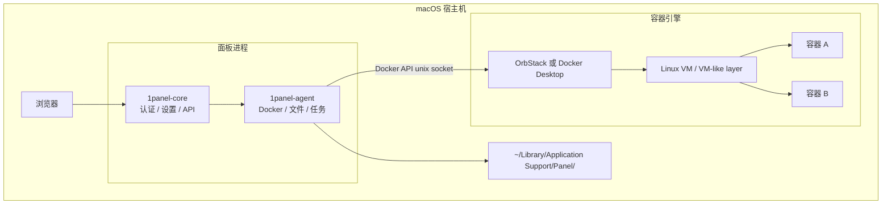
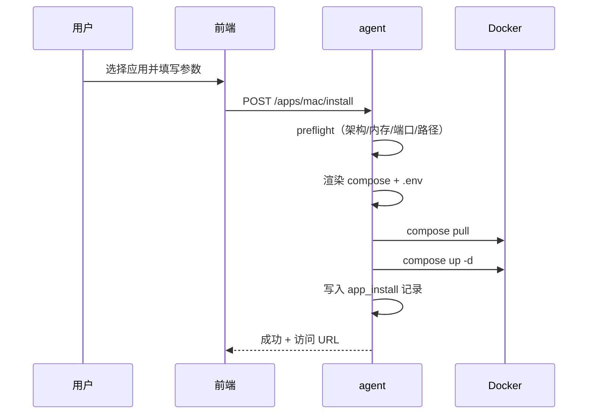

# macOS 专属运维面板 — 产品需求说明与技术方案

| 属性 | 内容 |
|------|------|
| 文档版本 | v0.1（草案） |
| 状态 | Draft — 供评审与迭代 |
| 基线代码 | 1Panel `dev-v2`（2.x 架构：core + agent + frontend） |
| 建议分支 | `platform/macos` 或 `cursor/macos-panel-*`（长期独立演进） |
| 许可证 | 遵循上游 GPLv3；对外分发须合规开源 |

---

## 1. 背景与动机

### 1.1 问题陈述

1Panel 当前面向 **Linux 服务器/VPS**，依赖 systemd、iptables/firewalld、宿主机 Nginx/OpenResty 等能力。用户在 **Mac mini / Mac Studio** 等设备上常作为：

- 家用 NAS / 软路由旁路 / 开发机
- Docker 容器宿主机（OrbStack、Docker Desktop）
- 本地 AI（Ollama 等）与自托管应用节点

若强行在 macOS 上运行官方 Linux 构建，会在服务管理、路径、防火墙、应用商店兼容性上全面失效。

### 1.2 产品机会

在 **独立 Git 分支** 前提下，基于 1Panel 已有资产（Vue 前端、Go 双服务、Docker/Compose 引擎），打造 **macOS 原生安装、以容器为中心** 的 Web 运维面板，填补「Mac 上缺少一体化自托管控制面」的空白。

### 1.3 与官方 1Panel 的关系

| 维度 | 官方 Linux 版 | 本方案（macOS 版） |
|------|---------------|------------------|
| 目标 OS | Linux 发行版 | macOS 13+（Ventura 及以后为主） |
| 核心能力 | 全栈服务器管理 | **Docker 栈 + 文件 + 终端 + 自研应用商店** |
| 代码关系 | 上游 | Fork 分支，选择性 cherry-pick |
| 品牌 | 1Panel | **建议独立产品名**（避免用户混淆） |
| 应用商店 | 官方 165+ Linux 应用 | **Mac 精选商店**（自建仓库与 CI） |

---

## 2. 产品愿景与定位

### 2.1 愿景

> 让 Mac 用户通过浏览器，以最低心智负担管理本机 Docker 应用与数据，无需记忆 CLI 与零散 GUI。

### 2.2 定位（一句话）

**运行在 macOS 本机的 Web 控制面板，通过 OrbStack / Docker Desktop 管理容器化自托管服务。**

### 2.3 非目标（明确不做）

- 不追求与 Linux 版 **功能对等**（尤其宿主机防火墙、fail2ban、完整建站、多节点集群）。
- 不承诺兼容 **官方 1Panel 应用商店** 全量应用。
- 不把 macOS 变成「通用 Linux 服务器替代品」。
- v1 不提供 **远程管理多台 Linux 节点**（可列为 v2+）。

---

## 3. 目标用户与场景

### 3.1 用户画像

| 画像 | 特征 | 核心诉求 |
|------|------|----------|
| 家用自托管 | Mac mini 7×24，OrbStack/DD | 一键装 Immich、Home Assistant、数据库等 |
| 开发者 | MacBook / Studio，本地依赖用容器 | Compose、日志、端口、卷管理 |
| 创作者 / AI 尝鲜 | Apple Silicon | Ollama、Open WebUI 等容器化部署 |
| 进阶用户 | 熟悉 Docker，嫌 CLI 繁琐 | 文件浏览、终端、备份、监控一屏完成 |

### 3.2 典型场景

1. **首次安装**：下载安装包 → 检测 Docker 引擎 → 浏览器打开面板 → 从商店安装第一个应用。
2. **日常运维**：查看容器状态、重启、看日志、改环境变量、备份卷数据。
3. **排障**：Web 终端进入容器；主机文件管理器定位数据目录。
4. **升级**：面板自更新 + 商店应用一键升级（Compose pull/up）。

---

## 4. 产品范围

### 4.1 版本规划总览

| 版本 | 主题 | 交付标准 |
|------|------|----------|
| **MVP（v0.9）** | 能跑起来 | darwin 二进制 + launchd；登录；Docker 只读列表 |
| **v1.0** | 可日常使用 | 容器 CRUD、Compose、文件、终端、Mac 商店 ≥15 应用 |
| **v1.1** | 体验加固 | 安装包签名、引擎自动检测、备份到云 |
| **v2.0** | 扩展 | 简易反代（Caddy 容器）、Ollama 套件、Apple 监控 |

### 4.2 v1.0 功能清单

#### 4.2.1 必须有（P0）

| 模块 | 功能点 | 验收标准 |
|------|--------|----------|
| 安装与生命周期 | macOS 安装器 / 脚本；launchd 托管 core+agent | 重启后自启动；`1pctl status` 可用 |
| 面板基础 | 登录、MFA（复用 core）、修改端口/密码 | 与 Linux 版安全基线一致 |
| Docker 引擎 | 检测 OrbStack / Docker Desktop；可配置 socket | `docker info` 成功；断连有明确提示 |
| 容器 | 列表/详情/启停/删除/日志/终端 | 覆盖常用操作 |
| Compose | 项目列表、启停、编辑 compose 文件、拉取镜像 | 支持 `docker compose` v2 |
| 镜像 | 列表、拉取、删除、清理悬空镜像 | — |
| 网络与卷 | 列表、基本管理 | v1 可不做高级策略编辑 |
| 文件 | 浏览安装目录、上传下载、权限提示 | 路径限制在 `InstallDir` 内 |
| Web 终端 | 连接容器 / 可选本机 shell | 危险命令拦截（复用现有策略） |
| 监控首页 | CPU/内存/磁盘、容器资源概览 | gopsutil + Docker API |
| Mac 应用商店 | 浏览、安装、卸载、升级、参数表单 | ≥15 个经 CI 验证的应用 |
| 设置 | 安装路径、Docker socket、语言 | — |

#### 4.2.2 应该有（P1）

| 模块 | 功能点 |
|------|--------|
| 计划任务 | 定时执行脚本 / Compose 拉取（复用 cronjob，去掉 Linux 备份类型） |
| 备份 | 卷/Compose 项目打包；可选 S3/R2（复用 backup 子集） |
| 日志 | 面板操作日志、容器日志聚合入口 |
| 引擎引导 | 未安装 Docker 时跳转 OrbStack/DD 官网与安装说明 |

#### 4.2.3 不做（v1 明确排除）

| 模块 | 原因 |
|------|------|
| 宿主机防火墙（iptables/ufw/firewalld） | macOS 使用 pf，需单独产品定义 |
| fail2ban / ClamAV / SELinux | Linux 安全栈 |
| 完整「网站」模块（宿主机 Nginx+PHP） | 与 Linux 建站模型绑定；v2 用容器反代替代 |
| 主机 SSH 服务管理 | 系统偏好设置即可 |
| Supervisor 宿主机版 | 进程应在容器内 |
| 官方应用商店同步 | 架构与镜像假设不同 |
| Linux 快照包（`1panel-*-linux-*`）恢复 | 需独立 darwin 快照格式 |
| nvidia-smi GPU 面板 | v1 不做；Apple GPU 列为 v2 研究项 |
| 多节点 / xpack 远程 Linux | 非 v1 目标 |

### 4.3 v2.0 展望（占位）

- **反向代理**：预置 Caddy/Traefik 容器 + 域名/证书向导（Let's Encrypt DNS/HTTP）。
- **本地 AI**：Ollama + Open WebUI 商店模板；基础模型管理。
- **Apple Silicon 监控**：内存带宽、ANE 等（视可行性）。
- **远程节点**：仅当确有需求再评估 SSH + agent 轻量模式。

---

## 5. 非功能需求

| 类别 | 要求 |
|------|------|
| 性能 | 面板空闲内存占用 &lt; 200MB（core+agent 合计目标）；首页加载 &lt; 2s（本机） |
| 安全 | 默认仅监听 localhost 或 LAN；强制首次改密；API Token 机制保留 |
| 兼容 | macOS 13+；Apple Silicon（arm64）与 Intel（amd64）双架构 |
| Docker | OrbStack 与 Docker Desktop 24+；Compose v2 |
| 可用性 | Docker 未运行时面板可打开并引导，不崩溃 |
| 可维护 | 平台相关代码收敛在 `internal/platform`；禁止散落硬编码 `/etc` |
| 合规 | GPLv3；第三方 NOTICES；Docker 商标合规表述 |

---

## 6. 技术架构

### 6.1 逻辑架构



### 6.2 与现有仓库模块映射

| 现有目录 | macOS 分支策略 |
|----------|----------------|
| `frontend/` | **保留为主**，通过路由/功能开关隐藏 Linux 菜单 |
| `core/` | **保留**，改造路径、升级、安装；删除仅 Linux 的 API |
| `agent/` | **保留主体**，Docker/文件/任务复用；Linux 服务代码 `//go:build linux` |
| `docs/`（小写） | 不改动；Mac 文档放 `DOCS/` |
| 安装脚本（上游外部） | **新建** `scripts/macos/` |

### 6.3 平台抽象层（核心新增）

建议在 `core` 与 `agent` 共享（或各自薄封装）引入：

```text
internal/platform/
  platform.go          # 接口定义
  paths.go             # 安装目录、日志、数据目录
  darwin/
    paths_darwin.go
    service_launchd.go
    docker_darwin.go
    os_darwin.go
  linux/
    ...                # 自上游迁移的既有逻辑，便于 cherry-pick
```

#### 6.3.1 `Platform` 接口（草案）

```go
// Platform 聚合 macOS / Linux 差异实现
type Platform interface {
    OS() string                    // "darwin" | "linux"
    Paths() Paths
    ServiceManager() ServiceManager
    Docker() DockerHost
    HostInfo() HostInfoProvider
}

type Paths interface {
    InstallDir() string            // 数据根
    ConfigDir() string
    LogDir() string
    BinDir() string                // 1pctl 所在目录
    AppsDir() string               // 1panel/apps
    AppResourcesDir() string       // 商店包缓存
    DockerSocketDefault() string
}

type ServiceManager interface {
    // 管理面板自身进程；不管理 Docker 引擎（macOS）
    InstallPanelService() error
    UninstallPanelService() error
    RestartPanel(core, agent bool) error
    StatusPanel() (ServiceStatus, error)
}

type DockerHost interface {
    DetectEngine() (EngineKind, error)  // OrbStack | DockerDesktop | Unknown
    DefaultSocket() string
    IsReachable(ctx context.Context) error
    // macOS：不实现 systemctl restart docker
}
```

#### 6.3.2 默认路径约定（darwin）

| 用途 | 路径 |
|------|------|
| 安装根目录（默认） | `~/Library/Application Support/1Panel` |
| 配置文件 | `{InstallDir}/conf/app.yaml` |
| SQLite | `{InstallDir}/db/` |
| 日志 | `{InstallDir}/log/` |
| 应用数据 | `{InstallDir}/apps/` |
| Mac 商店包 | `{InstallDir}/resource/apps/mac/` |
| CLI | `/usr/local/bin/1pctl` 或 `{InstallDir}/bin/1pctl`（安装时写入 PATH） |
| launchd plist | `~/Library/LaunchAgents/dev.1panel.core.plist` 等 |

> 允许高级用户安装时自定义 `InstallDir`，但需检测 Docker 文件共享授权。

### 6.4 构建与发布

#### 6.4.1 构建目标

```makefile
# 示意：Makefile.macos
build-macos-arm64:
 cd core && CGO_ENABLED=0 GOOS=darwin GOARCH=arm64 go build -o ../build/1panel-core ./cmd/server
 cd agent && CGO_ENABLED=0 GOOS=darwin GOARCH=arm64 go build -o ../build/1panel-agent ./cmd/server
 cd frontend && npm run build:pro
 # 将 frontend dist 嵌入 core/cmd/server/web/assets
```

#### 6.4.2 发布物

| 产物 | 说明 |
|------|------|
| `1panel-macos-{version}-arm64.pkg` | 推荐：签名 + notarize |
| `1panel-macos-{version}-amd64.pkg` | Intel Mac |
| `1panel-macos-{version}.tar.gz` | 便携包（高级用户） |
| `SHA256SUMS` | 校验 |

**不再使用** `1panel-{version}-linux-{arch}.tar.gz` 作为 Mac 升级包。

#### 6.4.3 升级链路改造点

- `core/app/service/upgrade.go`：下载 URL 改为 `darwin` + `arm64`/`amd64`。
- 快照命名：`1panel-{scope}-{version}-darwin-{arch}-{time}`。
- 恢复逻辑：禁止跨 OS 恢复（保留现有架构校验思路）。

### 6.5 Docker 集成细节

#### 6.5.1 Socket 探测顺序

1. 用户配置项 `DockerSockPath`（DB）
2. 环境变量 `DOCKER_HOST`
3. 默认候选：
   - `unix:///var/run/docker.sock`（OrbStack 常可用）
   - `unix://$HOME/.docker/run/docker.sock`（Docker Desktop 新版）
4. `docker context ls` 解析（可选增强）

#### 6.5.2 引擎检测

| 引擎 | 检测方式 | UI 展示 |
|------|----------|---------|
| OrbStack | `docker info` 中 `Name` / `Operating System` 含 OrbStack 特征；或存在 `/Applications/OrbStack.app` | OrbStack |
| Docker Desktop | `com.docker.docker` 进程；或 `Docker Desktop` 应用存在 | Docker Desktop |
| Unknown | API 可达但无法区分 | 通用 Docker |

#### 6.5.3 需删除或替换的 Linux 逻辑

当前 `agent/app/service/docker.go` 中：

- `controller.Handle("restart", "docker")` → **macOS 改为** `DockerHost.IsReachable` + 前端引导打开应用
- `docker.socket` systemd 单元 → **删除**

`daemon.json` 路径：

| 引擎 | 典型路径 |
|------|----------|
| Docker Desktop | `~/Library/Group Containers/group.com.docker/settings.json` 或 `~/.docker/daemon.json`（以实现为准） |
| OrbStack | 以官方文档为准；面板 v1 **可只读展示** daemon 配置，写入列为 P1 |

#### 6.5.4 Compose 执行

- 优先 `docker compose`（与现网一致）。
- 工作目录：`{InstallDir}/apps/{appKey}/{instanceName}/`。
- 环境文件：`.env` 由面板表单生成，禁止 shell 注入（沿用现有校验）。

### 6.6 前端改造

#### 6.6.1 功能开关

```typescript
// 示意：frontend/src/config/platform.ts
export const platform = import.meta.env.VITE_PLATFORM ?? 'linux';

export const featureFlags = {
  hostFirewall: platform === 'linux',
  website: platform === 'linux',
  macAppStore: platform === 'darwin',
  dockerEngineWizard: platform === 'darwin',
};
```

构建 Mac 版时：`VITE_PLATFORM=darwin npm run build:pro`。

#### 6.6.2 菜单裁剪（v1）

| 保留 | 隐藏 / 移除 |
|------|-------------|
| 首页、容器、应用商店（Mac）、文件、终端、计划任务（精简）、设置、日志 | 主机防火墙、SSH、FTP、fail2ban、网站、数据库（宿主机）、Clam |

#### 6.6.3 文案与品牌

- 关于页、标题栏使用 **独立产品名**（待定）。
- 增加「Docker 引擎」状态卡片（OrbStack/DD）。

### 6.7 Mac 应用商店规范

#### 6.7.1 目录结构

```text
{InstallDir}/resource/apps/mac/
  index.yaml                 # 应用索引（版本、分类、最低面板版本）
  homeassistant/
    manifest.yaml            # 元数据
    logo.png
    docker-compose.yml
    .env.example
    scripts/
      preflight.sh           # 可选：安装前检查
      postinstall.sh
  immich/
    ...
```

#### 6.7.2 `manifest.yaml` 字段（草案）

```yaml
key: homeassistant
name: Home Assistant
version: "2024.1.0"
category: home-automation
description: "..."

architectures:
  - arm64
  - amd64

requirements:
  panelMinVersion: "1.0.0"
  dockerMinVersion: "24.0"
  memoryMB: 2048
  diskGB: 10

compose:
  file: docker-compose.yml
  envFile: .env.example

ports:
  - host: 8123
    container: 8123
    protocol: tcp

volumes:
  - id: data
    host: "${INSTALL_DIR}/apps/homeassistant/data"
    container: "/config"
    required: true

macNotes:
  - "首次需在 Docker Desktop 文件共享中授权 InstallDir"
  - "端口 8123 若冲突请在安装向导中修改"

tags: [recommended, arm64-tested]
```

#### 6.7.3 索引 `index.yaml`

```yaml
apiVersion: mac-store/v1
revision: 42
updatedAt: "2026-05-24T00:00:00Z"
apps:
  - key: homeassistant
    version: "2024.1.0"
    recommend: true
  - key: immich
    version: "1.98.0"
```

#### 6.7.4 安装流程（时序）



#### 6.7.5 与现有 `app_install` 的关系

- **复用** `model.AppInstall`、任务队列、日志、端口冲突检测逻辑。
- **新增** `resource` 类型：`mac`（与 `local`/`remote`/`custom` 并列）。
- **不读取** 官方远程 `remote` 仓库（除非未来单独做转换器）。

#### 6.7.6 CI 验证（商店维护）

每个应用 PR 必须通过：

1. `docker compose config` 校验
2. arm64 拉取 + `up` 冒烟（CI runner：macOS + OrbStack）
3. 健康检查 URL（`healthcheck` 或脚本）
4. `down -v` 清理

### 6.8 安全设计要点

| 项 | 方案 |
|----|------|
| 绑定地址 | 默认 `127.0.0.1`；可选 LAN（显式风险提示） |
| 文件管理 | 路径规范化 + 禁止 `..` 逃逸 InstallDir |
| 终端 | 保留危险命令黑名单；Mac 本机 shell 默认关闭或二次确认 |
| Docker socket | 等价于 root 级能力；关于页明确说明 |
| 更新 | 签名校验；HTTPS 下载 |

### 6.9 可观测性

- 日志：`{LogDir}/core.log`、`agent.log`（logrus 现有方案）。
- 诊断包：一键导出「面板版本 / macOS 版本 / Docker info / compose 列表 / 最近错误日志」。

---

## 7. 分支与上游协同策略

### 7.1 分支模型

```text
dev-v2          # 上游主线（Linux）
  └── platform/macos   # 长期 Mac 产品线
        ├── feature/*
        └── release/macos-v1.0.x
```

### 7.2 合并策略

| 方向 | 策略 |
|------|------|
| 上游 → Mac | **Cherry-pick** 安全修复、Docker/前端通用 bug；避免整分支 merge |
| Mac → 上游 | 仅提交 **平台无关** 改进；`internal/platform` 抽象成熟后可考虑向上游贡献接口层 |
| 冲突高发区 | `website_*`、`firewall_*`、`host_tool.go`、`snapshot_*` — Mac 分支用 build tag 隔离 |

### 7.3 Build Tags 约定

```go
//go:build darwin
// agent/app/service/docker_darwin.go

//go:build linux
// agent/app/service/docker_linux.go
```

---

## 8. 实施路线图

### 8.1 阶段划分

| 阶段 | 周期（技术复杂度） | 交付物 |
|------|-------------------|--------|
| **P0 骨架** | 平台抽象 + darwin 编译 + launchd | 能登录的空面板 |
| **P1 Docker** | 容器/镜像/Compose 闭环 | 日常 Docker 管理可用 |
| **P2 商店** | Mac 商店规范 + 15 应用 + CI | 一键安装第三方应用 |
| **P3 发布** | 签名 pkg、文档、诊断工具 | 外部试用版 |
| **P4 加固** | 备份、计划任务、daemon 只读配置 | v1.0 正式版 |

### 8.2 里程碑验收（P3 结束 = v1.0）

- [ ] 全新 Mac（arm64）从安装到跑通 Immich 或 Home Assistant &lt; 30 分钟（含下载镜像）
- [ ] OrbStack 与 Docker Desktop 各至少 1 台真机测试通过
- [ ] 卸载面板不残留 launchd（可选保留数据目录）
- [ ] 无 Docker 时面板可启动并显示引导页
- [ ] 商店 15 个应用 CI 全绿

---

## 9. 风险与对策

| 风险 | 影响 | 对策 |
|------|------|------|
| 范围蔓延 | 工期失控 | PRD 功能开关 + 版本冻结会议 |
| 上游 drift | cherry-pick 成本上升 | 平台抽象、减少复制粘贴 Linux 文件 |
| 商店维护 | 应用质量参差 | CI 冒烟 + 分级（官方精选 / 社区） |
| Docker 路径差异 | 连接失败 | 自动探测 + 设置页手动覆盖 |
| 文件共享权限 | 容器启动失败 | preflight + 文档 + 安装向导提示 |
| Apple 公证 | 安装受阻 | 早期接入 Developer ID 签名 |
| 许可证 | 合规问题 | 保留 GPLv3 声明；独立品牌与仓库说明 |

---

## 10. 开放问题（评审时决定）

| # | 问题 | 选项 |
|---|------|------|
| 1 | 产品正式名称 | 1Panel Mac / PanelMac / 其他 |
| 2 | 默认安装路径 | `~/Library/Application Support/1Panel` vs `/opt/1panel` |
| 3 | 是否捆绑推荐 OrbStack | 仅检测 vs 安装器内嵌跳转 |
| 4 | v1 是否开放本机 shell 终端 | 默认关闭 / 开启需确认 |
| 5 | 商店更新源 | 内置 Git 仓库 vs CDN 静态 index |
| 6 | 与飞致云商业版关系 | 完全独立社区版 vs 未来 Pro |

---

## 11. 附录

### 11.1 词汇表

| 术语 | 含义 |
|------|------|
| core | 面板 API 与认证服务 |
| agent | 宿主机操作执行服务（Docker、文件等） |
| Mac 商店 | `resource/apps/mac` 下的应用目录与 index |
| 引擎 | OrbStack 或 Docker Desktop |

### 11.2 参考文件（上游代码锚点）

| 主题 | 路径 |
|------|------|
| Docker 客户端 | `agent/utils/docker/docker.go` |
| Compose | `agent/utils/compose/compose.go`、`agent/app/service/container_compose.go` |
| 应用安装 | `agent/app/service/app_install.go` |
| 目录初始化 | `agent/init/dir/dir.go` |
| 服务管理（Linux） | `agent/utils/controller/controller.go` |
| 升级包命名 | `core/app/service/upgrade.go` |
| 前端容器页 | `frontend/src/views/container/` |
| Makefile（交叉编译） | `Makefile` |

### 11.3 文档修订记录

| 版本 | 日期 | 说明 |
|------|------|------|
| v0.1 | 2026-05-24 | 初稿：PRD + 技术方案合一 |

---

*本文档为内部规划草案，实施时以实际分支 Issue 与 ADR 为准。*
